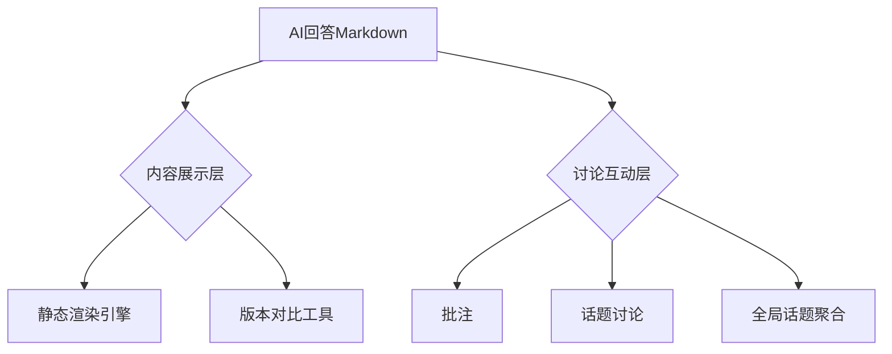
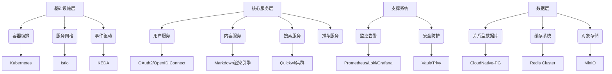
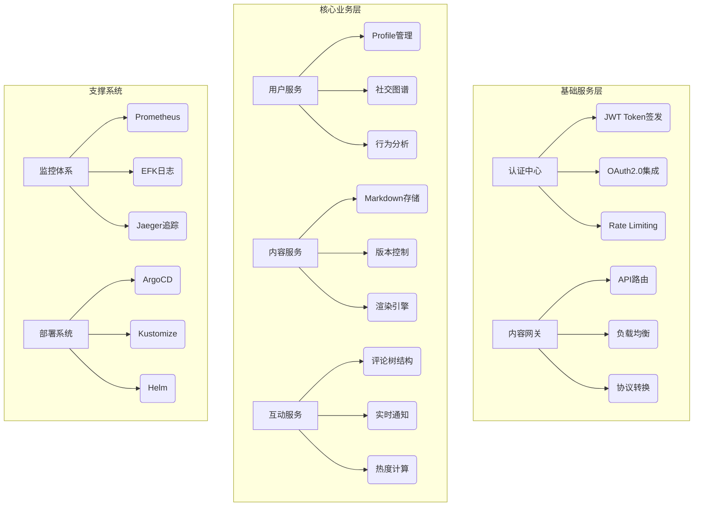

---
times:
begin: 2025-02-27
finish:
classify_project:
tags:
  - 1学习/4项目
website:
original:
purpose:
length:
rating:
aliases:
  - AnotherMentor
  - 答者
introduction:
---
# 2025-个人项目-专门针对AI回答内容讨论的平台

## 需求

<!-- 根据我的学习计划，我现在有两个任务，首先是我要完成博客和简历尽量获取面试机会，第二是尽快完成功能丰富、性能好、架构完整、完成度高的项目支持我的简历和博客内容。完成上面任务，我才能继续背诵八股文和刷算法。

目前我的主要问题是不知道完成什么项目，我希望在4个月内完成1-2个大型项目，向面试官展示我的云原生、后端开发能力，以下是我的项目要求：

1. 我希望开发不需要营业许可的项目  -->

>  我希望开发这样一个平台：我发现大家使用AI时都是一个人和AI聊天软件对话，但是大家有这样一个需求，有时候发现AI回答内容非常有意思，希望和大家分享，但是随着AI 能力增强，回答内容越来越长，分享越来越不方便。
>  目标：专门针对AI生成内容讨论的平台

<!-- - 你认为这有市场吗，如何去分析他的前景

请帮我详细分析我的需要，并且提供架构设计需要使用的软件和微服务化  -->

## 项目需求分析

- **市场需求**：
    - 从用户角度看，随着 AI 技术的飞速发展，越来越多的人使用 AI 生成内容。这些内容不仅包括简单的问答，还涵盖文学创作、代码生成、艺术创作、社会热点事件讨论等。用户可能会有强烈的分享自己使用 AI 生成的优质内容的需求，以及与其他用户交流使用心得、探讨 AI 应用的可能性等需求。一个专门针对 AI 回答内容讨论的平台可以满足这些需求，吸引广泛的用户群体，包括 AI 爱好者、技术开发者、内容创作者等。
    - 从行业角度看，AI 应用正在渗透到各行各业，企业和机构也越来越关注 AI 技术的应用和落地。一个专业的 AI 内容讨论平台可以成为行业交流、知识分享的重要场所，有助于推动 AI 技术的发展和应用。
- **竞争状况**：
    - 目前市场上可能还没有专门针对 AI 回答内容讨论的成熟平台，但存在一些通用的社区平台（如 Reddit、知乎等）或论坛，其中部分话题与 AI 相关。这些平台虽然具有用户基础，但在 AI 内容的深度、专业度和针对性方面可能有所不足。因此，专门的 AI 内容讨论平台具有一定的差异化竞争优势，但也要注意与现有平台的竞争，需要在内容质量、用户体验、社区氛围等方面下功夫，才能吸引用户并保持竞争力。
- **前景分析**：
    - **发展趋势**：AI 技术正处于高速发展阶段，未来将有更多的应用场景被开发出来，AI 内容的创造和分享需求也将持续增长。专门的 AI 内容讨论平台有望成为 AI 领域的重要基础设施之一，为用户提供交流、学习、合作的场所，推动 AI 技术的普及和应用。
    - **潜在用户**：随着 AI 技术的普及，潜在用户群体将不断扩大，包括个人用户（如 AI 爱好者、技术开发者、内容创作者等）和企业用户（如科技公司、研发机构、教育机构等）。这些用户对于 AI 内容的需求是多样的，包括获取知识、分享经验、寻求合作等，平台可以通过提供优质的服务和内容，满足不同用户的需求。
    - **商业价值**：通过广告、付费会员、内容付费等方式，平台可以实现商业变现。此外，平台还可以为企业用户提供定制化服务，如 AI 内容创作工具、数据分析服务等，进一步拓展商业价值。
- **目标用户**：
    - **个人用户**：
        - AI 爱好者：他们对 AI 技术感兴趣，希望通过平台了解和学习 AI 的最新发展和应用，与其他爱好者交流心得，分享自己的使用体验和创作成果。
        - 技术开发者：从事 AI 相关技术开发的人员，如数据科学家、机器学习工程师、软件开发者等。他们需要一个专业的平台来交流技术问题、分享开发经验、获取行业资讯，以提升自己的专业水平。
        - 内容创作者：包括作家、艺术家、设计师等，他们可以利用 AI 工具生成内容，并通过平台分享和展示这些内容，与其他创作者交流创作思路和技巧。
    - **企业用户**：
        - 教育机构：教育机构可以通过平台了解 AI 教育的最新趋势和需求，开发和分享 AI 教育资源，提升教育质量。

## 架构 Architecture

### 技术栈选择

#### 基础设施

- k8s：是容器编排的行业标准，能够自动化容器的部署、扩展和管理
- Istio：与 Kubernetes 集成后，能够在服务级别提供丰富的流量管理、安全控制和监控功能
- Dapr：一个可移植的、事件驱动的运行时，它将最佳实践的分布式系统中间件来抽象为简单的构建块
- KEDA：Kubernetes 事件驱动的自动缩放器，与 Horizontal Pod Autoscaler (HPA) 兼容
- kong：API网关，用于流量管理、协议转换、认证授权等功能

#### API

- fastapi/gin：Python 和 Golang RESTful API 开发框架
- go-zero/grpc：微服务开发框架
- pocketbase：开源实时的低代码后端，作为 NoSQL 数据库和 REST/GraphQL API，前期快速开发使用

#### 存储

- MinIO/S3：对象存储服务，可以用于存储用户生成的内容，如图片、视频、音频等文件
- PostgreSQL/cloudnative-pg：cloudnative-pg 是一个 Kubernetes 操作器，用于部署和管理 PostgreSQL 数据库
- Redis/dragonfly：缓存平台的热点数据，提高系统的响应速度

#### 监控

- Grafana：将各种数据源的指标和日志等数据可视化
- Loki：用于存储和查询平台的海量日志数据
- Prometheus：用于收集平台的各项指标数据
- OpenCost：用于 Kubernetes 成本分析，提供实时的资源成本监控和资源利用率分析
- Sentry：用于监控平台的代码运行状态，及时发现和修复错误
- Jaeger：分布式追踪系统，用于监控和故障排查分布式事务。

#### DevOps

- terraform：用于定义和管理平台的云基础设施，实现自动化部署和配置管理
- Ansible：用于自动化平台的部署和配置管理，提高部署效率，减少人为错误
- Github Action：CI/CD 流水线，支持自动化构建、测试和部署。
- ArgoCD：用于 Kubernetes 的声明式 GitOps，支持自动化同步和部署
- Helm：Kubernetes 包管理工具，用于打包和分发应用

#### 安全

- OAuth2-proxy：应用级身份验证网关
- Vault：机密管理工具，用于证书/密钥/凭证的安全存储
- Trivy：容器镜像漏洞扫描工具，集成到CI/CD流程
- OAuth 2.0/OpenID Connect：用于身份认证和授权，支持单点登录（SSO）和第三方登录。

#### 搜索与推荐模块

- quickwit/meilisearch：搜索引擎

>  推荐模块暂时缺少

#### 其它开发工具

- rclone：云存储管理
- git：版本控制
- skaffold：Kubernetes应用持续开发工具
- CasaOS：提供k8s服务，部署测试
- lens/k9s：集群操作基础工具
- Hoppscotch：API测试

### 方案参考

| 维度         | 笔记软件方案（如Obsidian/Notion式）                    | 聊天软件方案（如Slack/Discord式）     |
| ------------ | ------------------------------------------------------ | ------------------------------------- |
| 核心优势     | 完美支持Markdown渲染，内容结构清晰，适合长篇AI回答展示 | 实时互动性强，适合快速讨论和话题裂变  |
| 内容组织     | 树状目录+标签分类，便于知识沉淀                        | 线性时间轴排列，信息易淹没            |
| 用户参与度   | 被动式阅读为主，评论多为事后补充                       | 主动式即时交流，容易形成社区氛围      |
| 技术实现难度 | 需开发内容版本对比、复杂权限控制                       | 需处理消息推送、@提及、实时状态同步等 |
| 数据可分析性 | 结构化数据便于统计（如点赞/收藏次数）                  | 非结构化对话数据需NLP处理才能提取价值 |
| 典型开源案例 | Outline、Trilium、memos                                | Signal、Zulip、Rocket.Chat            |

### MVP

| 模块         | 必须实现功能                                                                               | 可延期功能                               |
| ------------ | ------------------------------------------------------------------------------------------ | ---------------------------------------- |
| **用户系统** | 
- 邮箱注册/登录   - 基础个人信息   - OAuth2.0快速登录
 | - 第三方登录   - 用户等级体系         |
| **内容发布** | - Markdown编辑器   - 元数据标注（关联AI类型/用途标签）   - 版本历史                  | - 自动抓取外部AI内容   - 富媒体嵌入   |
| **内容展示** | - 多级标题导航 - 代码块高亮 - 公式渲染                                               | - 交互式图表支持   - 语音朗读         |
| **互动系统** | - 评论/回复   - 点赞/收藏   - 基础评分（1-5星）                                      | - 评分维度细分   - 打赏功能           |
| **分享系统** | - 生成分享卡片   - 基础访问统计                                                         | - 第三方平台分享按钮   - 私密分享链接 |

### 完整开发

### 迭代开发路线（2025-03-01起）

| 时间节点   | 必须完成事项                 | 验收标准                             |
| ---------- | ---------------------------- | ------------------------------------ |
| 2025-03-07 | 用户注册登录流程跑通         | 支持邮箱验证+JWT签发                 |
| 2025-03-14 | Markdown编辑器与预览功能联调 | 支持5000字以上内容流畅编辑           |
| 2025-03-21 | 完成内容详情页基础渲染       | 代码块/公式正确显示+目录导航         |
| 2025-03-28 | 评论/点赞功能完成前后端联调  | 支持二级嵌套评论，500QPS压力测试通过 |
| 2025-04-04 | 完成分享卡片生成功能         | 支持OG协议，移动端正常展示           |
| 2025-04-11 | MVP全流程测试通过            | 核心路径覆盖100%测试用例             |
